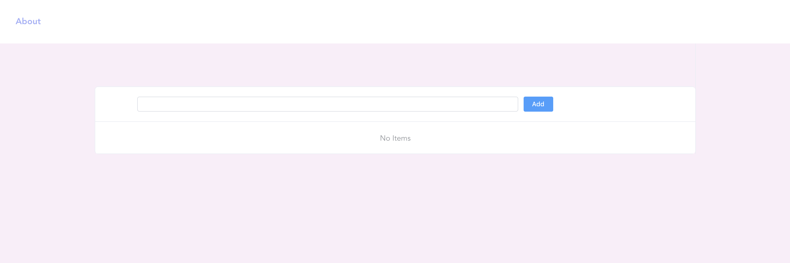
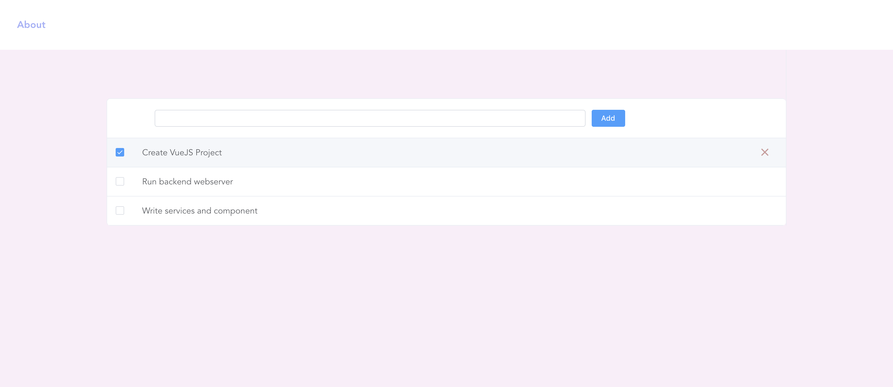
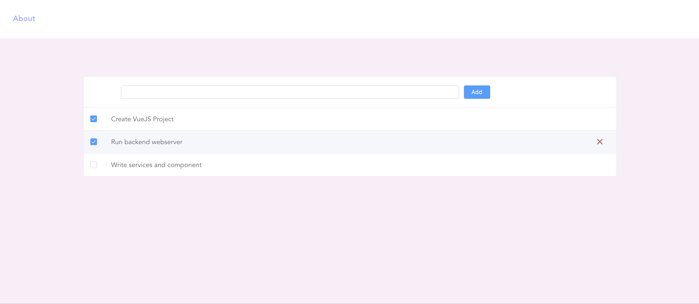
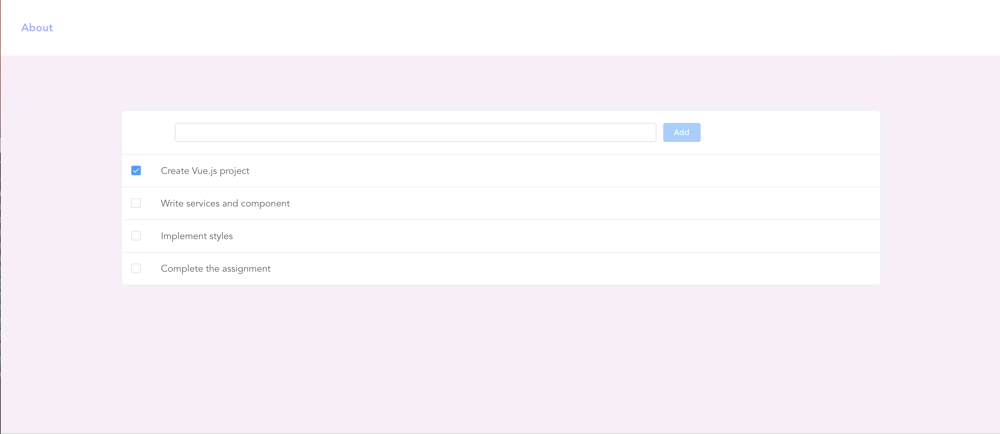

# vuejs-todolist
This is a Single-page application (SPA) in Vue.js implementing a simple Todo list. The application will maintain a Todo list of activities:
* adding an activity (item to the list),
* updating the activity (toggle status between completed/not completed),
* delete an activity, and
* list all the activities when the page is first loaded or reloaded

**Add todo**

**Update status**

**Delete todo**

**List**


## Project setup
```
npm install
```

**Start client application:**
```
npm run client:start or npm run serve
```
**Start Server application:**
```
npm run server:start
```

**Lints and fixes files:**
```
npm run lint
```

**Run your unit tests:**
```
npm run test:unit
```

